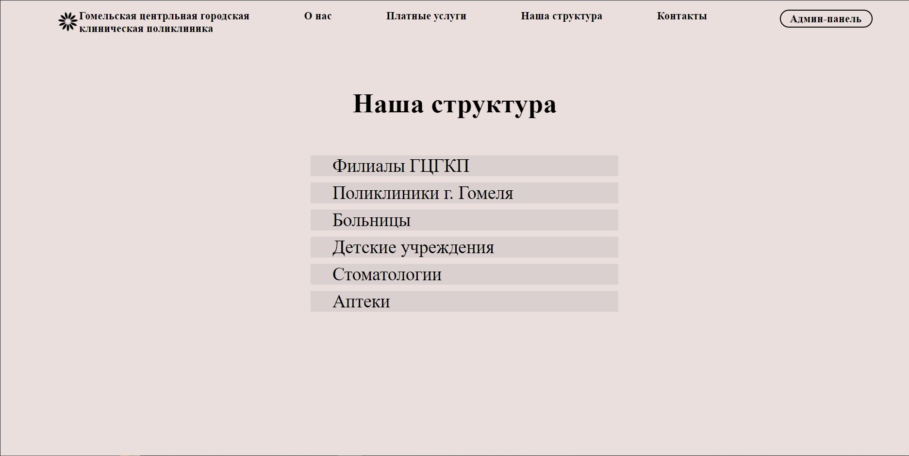

#:hospital: Polyclinic

Веб-приложение, которое обладает основными функциями больницы, а также имеет CRUD-операции для многих сущностей.
Проект разработан на Java 17 с использованием Maven для сборки, PostgreSQL для хранения данных, 
имеет зависимость spring-boot-starter-data-jpa, которая включает в себя hibernate, для взаимодействия с базой данных,
Lombok для упрощения работы с шаблонным кодом, Spring Security для реализации авторизации пользователей и защиты приложения,
библиотеки Spring Security tags для упрощения внедрения функций безопасности в представления,встроенного движка JSP для обработки JSP-страниц,
библиотеки JSTL для работы с JSP, биоблиотеки jquery для упрощения работы с JavaScript, также была импортирована зависимость Spring Validation для
включения поддержки валидации в Spring boot и, наконец, были включены базовые зависимости для использования АОП (AspectJ).

## Инструкция по запуску
* Клонировать репозиторий.
* Собрать проект с помощью Maven.
```bash
maven compile
maven package
```
* Поднять бд с помощью docker-compose.
```bash
docker-compose build
docker-compose up
```
* Запустить Main класс.

# Работа веб-приложения

Все следующие страницы будут представлены в 2-3 вариантах: 
1) - обычный пользователь
2) - пользователь с ролью врача
3) - админ
     
<br>

## Основная страница
1)


2) тут идентично только вместо "Личный кабинет" - "Админ-панель"
   
3) тут идентично только вместо "Личный кабинет" - "Админ-панель"
   
<br>

## Страница "О нас"
1)


2) тут идентично только вместо "Личный кабинет" - "Админ-панель"
  
3) тут идентично только вместо "Личный кабинет" - "Админ-панель"


## Страница "Платные услуги"
1)


2) тут идентично, как у user, только вместо "Личный кабинет" - "Админ-панель"
   
3) Тут администратор прямо на сайте может удалить уже ненужные процедуры либо же добавить новые в пару кликов


## Страница "Наша структура"
1)


2) тут идентично только вместо "Личный кабинет" - "Админ-панель"
   
3) тут идентично только вместо "Личный кабинет" - "Админ-панель"


## Пример страницы структурного элемента
1)


2) тут идентично, как у user, только вместо "Личный кабинет" - "Админ-панель"
   
3) Тут администратор прямо на сайте может удалить уже ненужные структурные элементы либо же добавить новые в пару кликов


## Страница входа
  


## Страница личного кабинета
  


## Страница админ панели
Здесь можно выбрать панель, которая нам нужна для использования


## Панель врачей
  
2) Доктор может лишь зайти в эту панель и открыть расписание любого из врачей (вероятнее всего свое).


3) Администратор может добавлять нового врача, к которому автоматически сформируются записи или же удалить имеющегося, вместе с которым удалятся все связанные записи


## Страница расписания для врача, на которого вы кликнули


## Панель пользователей

2) Врач может добавить нового пациента, который впервые обратился в больницу, но не может удалять


3) Администратор может создавать пользователей любых ролей, но удалять только пациентов


Все кнопки в панелях рабочие и можно создавать новые записи или уже удалять.
